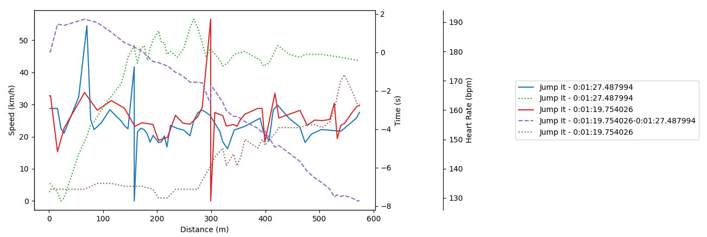

## MTB GPX Analyzer
This is a simple Python script to analyze GPX files from a GPS device. It was created to analyze GPX files from a Garmin watch (though it should work with any GPX file). The script plots speed, heart rate and time (or delta time if you choose to analyze only 2 runs), which helps a lot with performance analysis.

## How to use
1. Install the required packages:
```bash
pip install -r requirements.txt
```
2. Run the script:
```bash
python mtb_gpx_analyzer.py [path_to_gpx_file] [path_to_gpx_file2]
```

If you want to load a specific trail, find it in Strava, then copy its ID from the URL (e.g. https://www.strava.com/segments/1234567). Then run the `strava_fetch.py` script with the segment ID and name of the trail:
```bash
python strava_fetch.py 1234567 "Trail Name"
```


## Output
Here is an example of the output:

The solid line represents the speed, the dashed line represents the time (or delta time) and the dotted line represents the heart rate.
